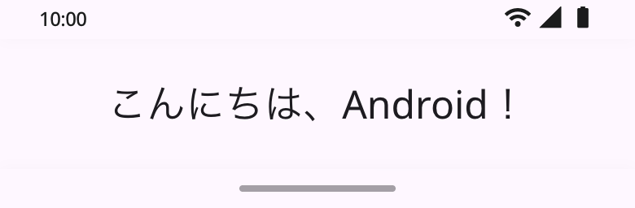

# A01：Stitch画面デザインの参照情報

[A01の要件・アプリ仕様](../README.md)に対応するGoogle Stitchのデザイン情報を記録する。

## 対象プロジェクト・画面

| 項目 | 内容 |
| --- | --- |
| デザインツール | Google Stitch |
| プロジェクト名 | 26CM_Android1 |
| プロジェクトID | `3692358824817406400` |
| プロジェクト参照先 | [Stitchでプロジェクトを開く](https://stitch.withgoogle.com/projects/3692358824817406400) |
| 画面名 | はじめてのアプリ (完成状態) |
| 画面ID | `49a1dc8271eb4772a77097136b37afc6` |
| 対応課題 | A01：はじめてのアプリ |
| 対応する状態 | 必須課題の完成状態。「こんにちは、Android！」を表示する画面。 |
| 情報源 | ユーザー提供のプロジェクト・画面ID、およびStitch上で確認したプロジェクト名・画面名とエクスポート原本。 |
| 記録日 | 2026年9月14日 |

画面名とIDをセットで使い、初期状態や別のデザインを取得しないようにする。上記のプロジェクト参照先は画像・コードのダウンロードURLではない。

## 教員側の画面実装方針

教員がAndroidアプリの画面を実装する際は、Stitch MCPを活用して対象画面の最新情報・画像・生成コードを取得する。取得日と画面IDを記録し、下記の保存原本から変更された点を確認して、Java・XML・LinearLayoutへ反映する。仕様との差分は本書に記録し、実装方針をそろえる。

完成したAndroidアプリを指定エミュレーターで実行し、文言、配置、色、システムバーとの重なりを確認する。その実行画面を学生向けHTML教材の完成見本とする。Stitchの生成HTMLはデザイン資料であり、学生向けの手順を説明するHTML教材は別途作成する。[教材作成方針](../../../docs/teaching-materials-guide.md)

現在保存している原本はブラウザーから取得したもので、Stitch MCPを用いた取得・Android実装はまだ行っていない。

## 画像・生成コードの取得状況

2026年9月14日、ログイン後にプロジェクト「26CM_Android1」と画面「はじめてのアプリ (完成状態)」を閲覧できた。対象画面を選択し、Stitchの「Export → .zip」で画像・生成コード・デザイン資料を取得した。

取得元ZIPは`stitch_26cm_android1 (1).zip`。以下の3ファイルは内容を変更せず、`stitch-export`フォルダへ保存した。今回はブラウザーのエクスポート機能で取得できたため、ホストされたURLからの`curl -L`ダウンロードは使用していない。

| 対象 | 保存ファイル | 確認結果 |
| --- | --- | --- |
| 完成画面の画像 | [screen.png](stitch-export/screen.png) | PNG、780×256px。表示文言を目視確認済み。 |
| 画面の生成コード | [code.html](stitch-export/code.html) | HTML・CSS・JavaScript。AndroidのJava／XMLコードではない。 |
| デザイン資料 | [DESIGN.md](stitch-export/DESIGN.md) | エクスポートに同梱された「First Step Minimalist」のデザイン定義。 |

### 取得した画面画像

この画像は取得時の原本で、スマートフォンの全画面見本として補正した画像ではない。縦向き端末での完成条件の確認には、下記の差分を考慮する。

## A01の画面仕様との照合

| 項目 | Stitchの取得内容 | A01への反映方針 |
| --- | --- | --- |
| 表示文言 | 「こんにちは、Android！」。HTMLの要素IDは`greeting_message`。 | 仕様と一致。Androidではstrings.xmlの同名リソースを使う。 |
| 画面構成 | あいさつが1つ。時刻・通信・電池・ナビゲーションの表示はHTML内で模擬描画している。 | アプリ独自の部品はTextView 1つ。システムバーはAndroid側の表示を利用する。 |
| 背景色 | HTMLのインライン指定は`rgb(254, 247, 255)`（#FEF7FF）。画像も薄い色付きの背景。 | 仕様案の白（#FFFFFF）と異なる。Android実装では仕様案の白を維持する。 |
| 文字色 | あいさつのインライン指定は`rgb(29, 27, 32)`（#1D1B20）。 | 仕様案の#212121と異なる。Android実装では仕様案の色を維持する。 |
| 文字サイズ・余白 | 文字のスタイル定義は24px・行高32px。余白トークンは24px。 | Androidでは24sp・24dpを使用する。CSSのpxとAndroidのsp／dpを実測で同一とみなさない。 |
| 画像の縦横比・配置 | PNGは780×256px。Stitchの詳細では390×128と表示。HTMLには最小高さ884pxの指定がある。 | 取得画像とHTMLの寸法指定が一致していない。原画像は参照資料とし、縦向き端末の中央配置・システムバーとの重なりはAndroid実装時に確認する。 |
| タップ時の動作 | HTMLに押下時の縮小と、ダブルタップ時の透明度・拡大率を変える処理が含まれる。 | A01の操作範囲にないため、Android実装には追加しない。 |
| フォント・外部依存 | Google Fonts、Material Symbols、Tailwind CDNを参照している。 | Webのプレビュー用依存として原本に残す。Androidでは標準フォントと既存の初期依存関係を使用する。 |
| デザイン資料の範囲 | DESIGN.mdはボタン・入力欄・カード・タブレットなども説明し、配色トークンと本文の色指定にも差がある。 | A01の必須仕様として一括採用せず、1画面の課題範囲を維持する。 |

取得物は**デザインの参照原本**とする。色や配置・動作の差分を理由にアプリ仕様を自動変更せず、実装・評価の基準には[A01の要件・アプリ仕様](../README.md)を用いる。Stitch側のデザイン修正、HTMLの実行確認、Androidでのビルド・実機確認は今回実施していない。

## 原本の確認情報

ファイルの同一性を確認するため、取得時点のSHA-256を記録する。

| ファイル | SHA-256 |
| --- | --- |
| screen.png | `9b385dea26828d86a90338c202542f2b157b55d338be41fb93fb371a6701157c` |
| code.html | `ac545976c5aed3c7b7bea83b53dcf3ebde7ba0809d3a4c2a9e1b4cb5d5334ef5` |
| DESIGN.md | `37043aa27b285c663ebe689bfec8e7ed389e764e34ae52395ec6b901cce02da6` |

再取得する際は、プロジェクトID・画面ID・画面名を照合し、取得日、保存ファイル、ハッシュ、仕様との差分を更新する。生成コードの原本とAndroidアプリのソースは区別して管理する。
